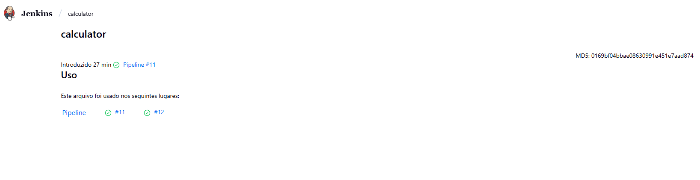
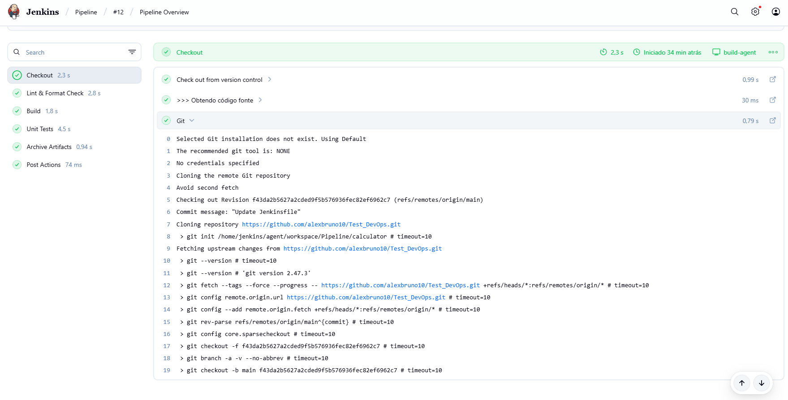
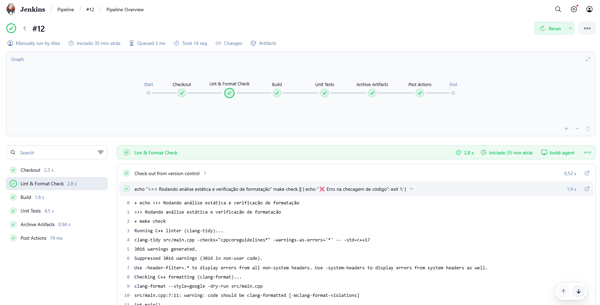
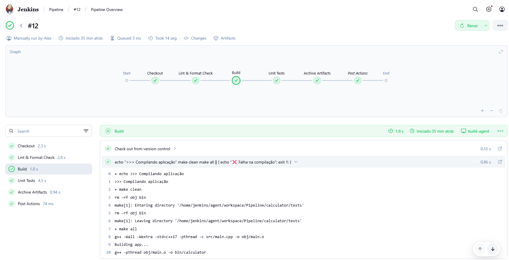
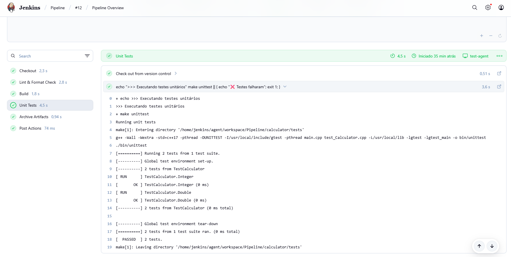
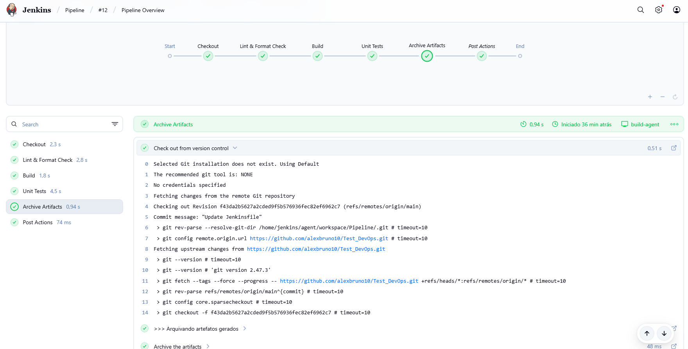
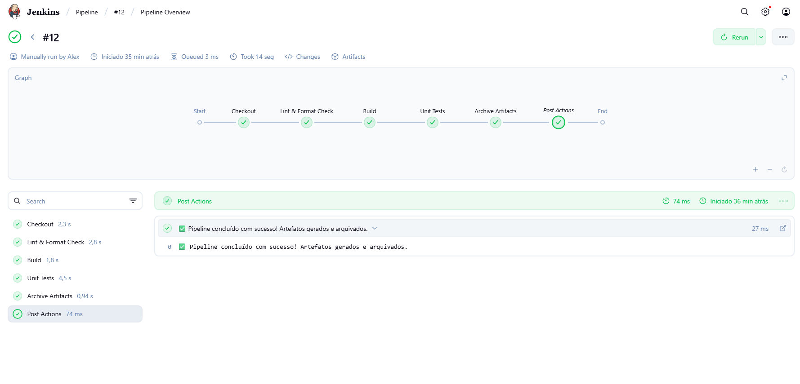
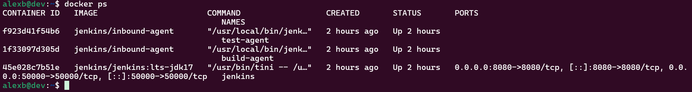

## 1. Descrição do Ambiente

- **Servidor Jenkins:** Local, Ubuntu 24.04  
- **Agentes Jenkins:**
  - `build-agent` – responsável pelo checkout, lint e build
  - `test-agent` – responsável pela execução de testes unitários
- **Linguagem e compilador:** C++17, GCC  
- **Gerenciador de build:** Make (`make`)  
- **Controle de versão:** Git, repositório no GitHub: [https://github.com/alexbruno10/Test_DevOps](https://github.com/alexbruno10/Test_DevOps)  
- **Ferramentas de qualidade:** 
  - `clang-tidy` para lint  
  - `clang-format` para verificação de estilo  
- **Artefatos:** Binários gerados em `calculator/bin/` e arquivados pelo Jenkins com fingerprint  

---

## 2. Descrição do Pipeline

Pipeline declarativo configurado no `Jenkinsfile` com os seguintes estágios:

| Estágio | Agente | Descrição |
|---------|--------|-----------|
| Checkout | build-agent | Clona o repositório do GitHub na branch `main` |
| Lint & Format Check | build-agent | Executa `make check` para análise estática e verificação de estilo |
| Build | build-agent | Executa `make clean` e `make all` para gerar os binários |
| Unit Tests | test-agent | Executa `make unittest` para rodar testes unitários com GoogleTest |
| Archive Artifacts | build-agent | Arquiva os binários (`bin/**/*`) com fingerprint no Jenkins |

### Gatilhos configurados:

- **Manual:** pipeline pode ser disparado sob demanda  
- **Automático:**
  - Cron diário: `H 3 * * *` (3h da manhã)
  - Webhook GitHub: disparo automático ao fazer push (não funcional localmente)  

---

## 3. Problemas Encontrados e Soluções

| Problema | Sintoma | Solução |
|----------|---------|---------|
| Testes unitários falhando por divisão por zero | `Floating point exception (core dumped)` ou exceções "Divisão por zero" | Alterei o `calculator.hpp` para lançar exceção ao dividir por zero e ajustei `test_calculator.cpp` para testar casos seguros e casos de zero com captura de exceção |
| Artefatos não visíveis | Jenkins não mostrava arquivos após build | Corrigi a etapa de arquivamento usando `archiveArtifacts artifacts: 'bin/**/*', fingerprint: true` |
| Warnings de formatação e clang-tidy | Mais de 3000 warnings gerados por headers do sistema | Ignorei warnings de headers externos e foquei nos warnings do código do projeto usando flags apropriadas |
| Falha em compilação ou testes | `make` retornava erro se algum comando falhasse | Adicionei uma mensagem de erro em cada etapa crítica no `Jenkinsfile` para garantir que o pipeline falhasse em caso de erro |
| Falhas de conexão na instância | Perda de conexão | A instância ubuntu perdeu conexão várias vezes durante o teste, deste modo, configurei o ambiente localmente |
| Containers sem comunicação | Agentes e Controlador sem comunicação | Pelo fato de ter configurado o ambiente local, criei uma rede no docker e conectei o controlador e os agentes |

---

## 4. Artefatos Gerados

- Todos os binários da aplicação são gerados no diretório `calculator/bin/`  
- Arquivos arquivados no Jenkins, disponíveis na interface em cada build  
- Fingerprints permitem rastrear a utilização do artefato entre builds  

Exemplo de artefato:
calculator/bin/calculator
MD5: 0169bf04bbae08630991e451e7aad874

  

---

## 5. Fluxo de Execução do Pipeline

1. **Checkout do código**

  

2. **Lint e Formatação**

  

3. **Build**

  

4. **Testes Unitários**

  

5. **Arquivamento de Artefatos**

  

5. **Post Actions**

  

---

## 6. Docker

Criado 3 containers, sendo 1 para o Jenkins (Controlador) e 2 para os agentes (Build e Test):

  

---

## 7. Observações Finais

- Pipeline falha imediatamente se algum estágio crítico (lint, build ou testes) falhar.  
- Estrutura modular: 1 controlador e 2 agentes, sendo um de build e outro de teste, em docker.  
- Código está pronto para CI/CD, com binários arquivados e rastreáveis.
